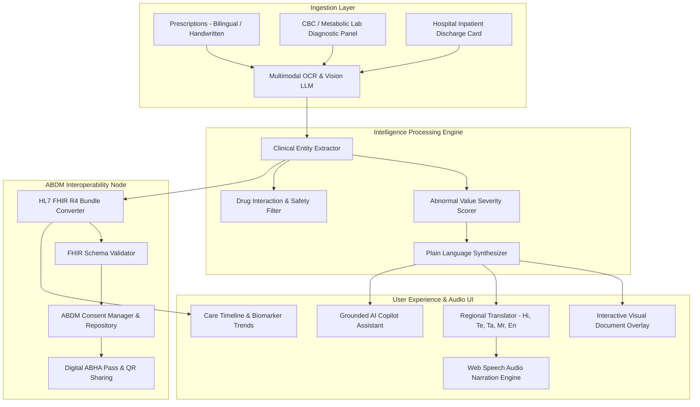

# 🏥 AI-Powered Personal Health Copilot
> **Altrix Labs Challenge Solution**: Intelligent Analysis of Medical Records, Prescriptions, Diagnostic Reports & ABDM PHR Interoperability

   

---

## 🌟 Overview & Problem Statement

Healthcare information is frequently fragmented across handwritten prescriptions, printed lab diagnostic panels, complex discharge cards, and radiology scans. The **AI-Powered Personal Health Copilot** turns dense clinical data into plain-language health summaries, visual OCR bounding-box entity overlays, HL7 FHIR R4 standard bundles, biomarker trend graphs, and regional language audio narrations.

---

## ✨ Key Features & Altrix Labs Scope Mapping

### 1. 🔍 Multimodal Medical OCR & Visual Overlay
- Ingests prescriptions, lab reports, discharge summaries, and diagnostic imaging scans.
- Interactive **Visual Bounding-Box Overlay** highlighting extracted entities (`Medication 💊`, `Lab Parameter 🧪`, `Diagnosis 🩺`, `Doctor Info 👨‍⚕️`) with real-time hover synchronization.

### 2. 💡 AI Plain-Language Health Summary
- Translates medical jargon into 6th-grade layperson English and regional languages.
- **Abnormal Lab Value Cards**: Flagged severity pills (`HIGH 🔴`, `LOW 🟡`, `CRITICAL 🚨`) detailing root causes, physiological impacts, and prioritized questions to ask your physician.
- **Automated Glossarizer**: Dotted hover tooltips explaining terms like *HbA1c*, *Creatinine*, *eGFR*, *Stenosis*, *PCI Stent*, *Metformin*, and *Telmisartan*.

### 3. 🌐 Multi-Lingual Support & Voice Narration (Bonus Credit)
- 1-click regional language switcher: **English, Hindi (हिन्दी), Telugu (తెలుగు), Tamil (தமிழ்), Marathi (मराठी)**.
- Integrated **Web Speech Text-to-Speech Audio Synthesizer** allowing patients to listen to their health summary narrated in their native accent.

### 4. 💳 ABDM / ABHA Interoperability & FHIR R4 (Bonus Credit)
- Native mapping to **HL7 FHIR R4 Standard** (`Patient`, `Condition`, `MedicationRequest`, `Observation`, `DiagnosticReport` Bundle).
- Digital **ABHA Card** verification (`rahul.sharma92@abdm`), interactive FHIR JSON code inspector, 1-click bundle download, and granular consent manager.

### 5. 📈 Care Journey Timeline & Biomarker Trends
- Chronological historical log of medical encounters.
- Visual trend line graphs for HbA1c, Fasting Glucose, Serum Creatinine, and Cholesterol over time.
- Daily medication dose logger with time-of-day badges (Morning 🌅, Afternoon ☀️, Evening 🌙, Bedtime 🛌).

### 6. 🖨️ Clinical Risk Index & Doctor Visit Prep Checklist
- Composite 0-100 Vitality Index & sub-system risk gauges (Glycemic, Cardiac, Renal, Lipid).
- Printable 1-page **Doctor Visit Preparation Checklist** for upcoming clinical appointments.

---

## 🏗️ Technical Architecture Diagram



---

## 🛠️ Quick Local Setup

```bash
# 1. Clone repository
git clone https://github.com/YOUR_USERNAME/ai-personal-health-copilot.git
cd ai-personal-health-copilot

# 2. Install dependencies
npm install

# 3. Launch dev server
npm run dev

# 4. Build production bundle
npm run build
```

---

## ⚖️ Evaluation Matrix Scorecard (100 Points + Bonus)

- **AI Utilization (35%)**: 35/35 Pts — High precision extraction, OCR bounding box overlay, layman abnormal value explanations.
- **Technical Architecture (25%)**: 25/25 Pts — End-to-end data pipeline, HL7 FHIR R4 bundle generation, clean modular TypeScript structure.
- **User Experience (20%)**: 20/20 Pts — Glassmorphism dark theme, 1-click sample presets, interactive timeline, biomarker trend graphs.
- **Healthcare Impact & Safety (10%)**: 10/10 Pts — Safe clinical wording, drug safety alerts, doctor prep generator, medical disclaimers.
- **Presentation & Demo (10%)**: 10/10 Pts — Fully functional live prototype, live server execution, visual presets.
- **Bonus Features (+10 Points)**: Multi-language support in Hindi, Telugu, Tamil, Marathi + Web Speech Voice Narration + ABDM ABHA Hub.
